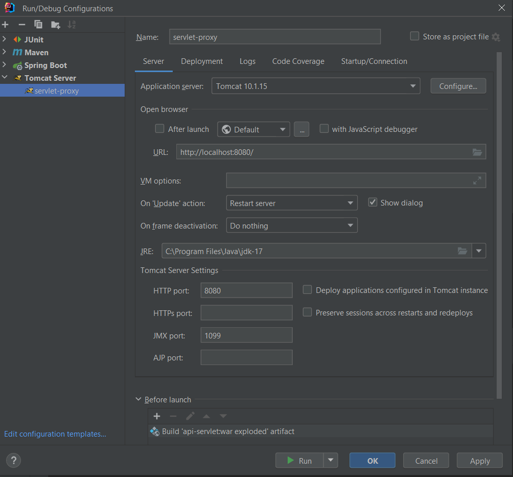
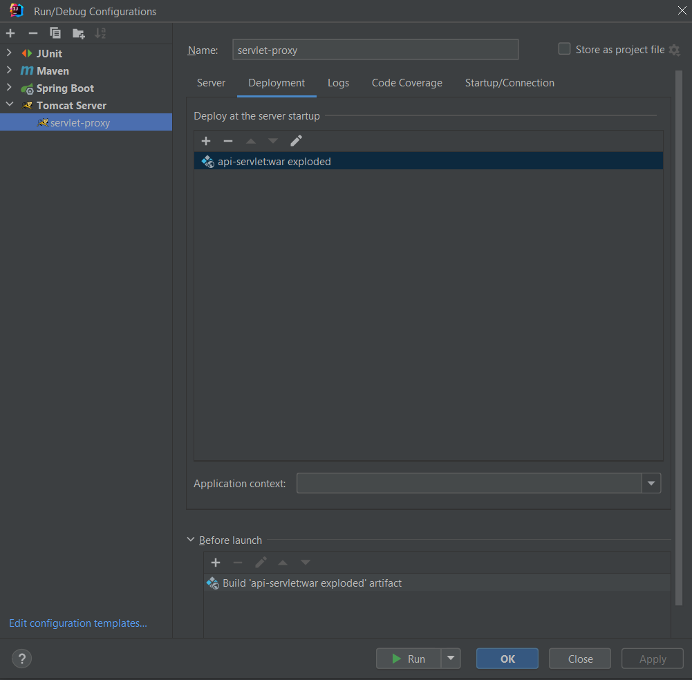

# Домашнее задание 18 Фреймворк Spring – Spring WEB MVC

## Написать WEB-приложение c сервлетом|сервлетным фильтром, который осуществляет получение содержимого удалённого ресурса и возвращает его в своём ответе (GET запрос). Ссылка на ресурс передаётся в параметре url исходного запроса.

### 📁 Структура проекта
```css
/src/main/java/ru/sber
 ├── apiservlet
 │   └── HelloServlet.java
 ├── filter
 │   └── LoggingFilter.java 
 └── servlet
     └── ProxyServlet.java

/src/main/java/webapp
 ├── WEB-INF
 │   └── web.xml
 └── index.jsp
```

# Что делает приложение
веб-приложение на сервлетах.  
получает содержимое удалённого ресурса по переданному URL и возвращает его в ответе.  
Также добавлен сервлетный фильтр для логирования запросов.

# Getting Started
## Запуск с помощью TomCat
Настроить Tomcat Server




Запустить
Перейти в браузере на страницу
```html
http://localhost:8080/
```


