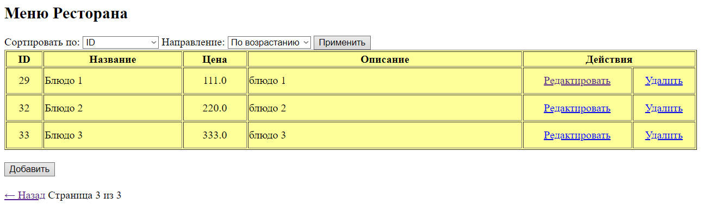
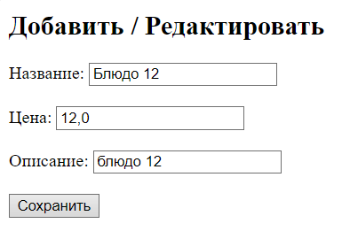

# Домашнее задание 18 Фреймворк Spring – Spring WEB MVC

## Реализовано CRUD приложение с использованием spring web (mvc) + БД (Postgres) + фронт 

### 📁 Структура проекта
```css
/src/main/java/ru/sber/mvc
 ├── controller
 │   └── MenuController.java
 ├── mapper
 │   └── MenuItemMapper.java    
 ├── model
 │   ├── dto
 │   │   └── MenuItemDto.java
 │   └── entity
 │        └── MenuItem.java
 ├── repository
 │   └── MenuItemRepository.java
 ├── service
 │   └── MenuItemService.java
 └── SpringmvcApplication.java

```

# Getting Started
## Запуск с помощью Compose
Чтобы запустить приложение Spring Boot в Docker с помощью предоставленного Dockerfile, выполните следующие шаги:

```bash
docker-compose up --build
```
### Проверьте состояние контейнера
Убедитесь, что контейнер работает:

```bash
docker ps
```
Вы увидите запущенный контейнер с именем springmvc-app. Если его нет в списке, проверьте логи контейнера:

```bash
docker logs menu
```
Для остановки контейнера выполните:

```bash
docker stop menu
docker stop postgres_menu
```

Чтобы удалить контейнер:
```bash
docker rm menu
docker rm postgres_menu
```

## Запуск в ручную Вариант 1
Выполнить:
```bash
copy "src/main/resources/db/create.sql" "c:\postgresdocker\postgresdockerinit-scripts"

copy "src/main/resources/db/insert.sql" "c:\postgresdocker\postgresdockerinit-scripts"  
```
```bash
docker run --name postgres_menu_DB_auto -p 5434:5432 -e POSTGRES_USER=postgres -e POSTGRES_PASSWORD=postgres -v c:\postgresdocker\postgresdockerinit-scripts\create.sql:/docker-entrypoint-initdb.d/create.sql -v c:\postgresdocker\postgresdockerinit-scripts\insert.sql:/docker-entrypoint-initdb.d/insert.sql -v c:\postgresdocker\springmvc-menu2:/var/lib/postgresql/data postgres:16
```

## Запуск в ручную Вариант 2
Выполнить:
```bash
docker run --name postgres_menu_DB -p 5434:5432 -e POSTGRES_USER=postgres -e POSTGRES_PASSWORD=postgres -v c:\postgresdocker\springmvc-menu:/var/lib/postgresql/data postgres:16
```
Запустить приложение:
```java
@SpringBootApplication
public class SpringmvcApplication {

    public static void main(String[] args) {
        SpringApplication.run(SpringmvcApplication.class, args);
    }

}
```
Можно наполнить БД данными `src/main/resources/db/insert.sql`


## Запрос в браузере
```http request
http://localhost:8080/menu?page=1&sortBy=id&direction=asc
```

Редактировать


##

