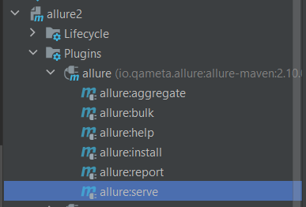
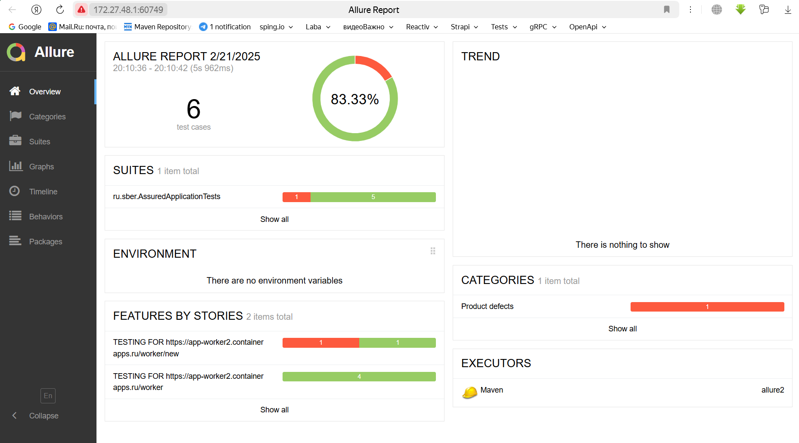
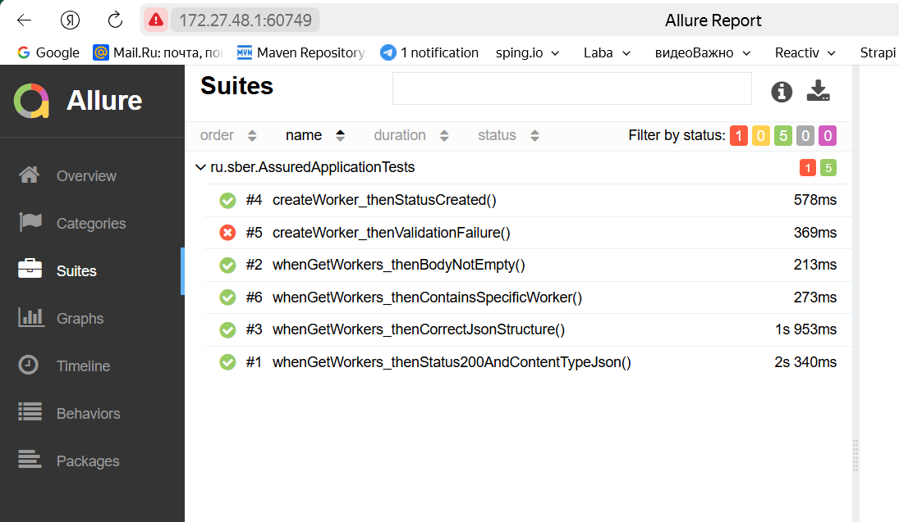
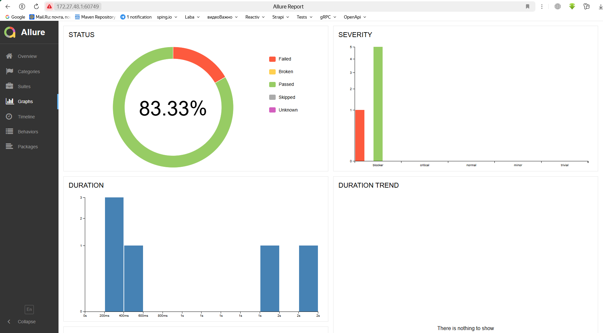
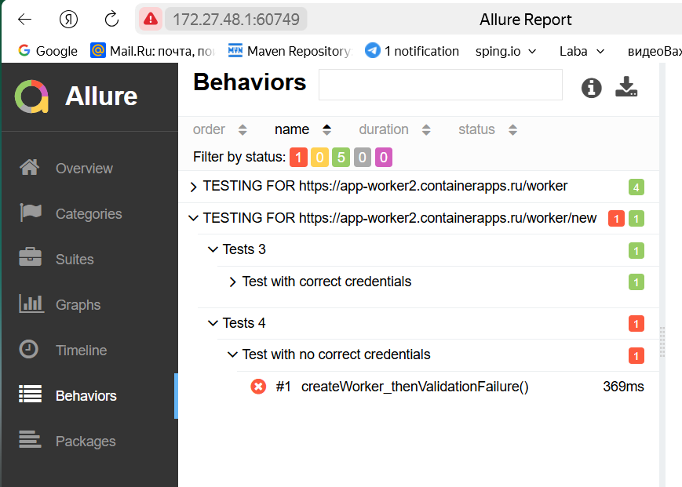

# Домашнее задание 23

# разработка автотестов UI-test часть 3

## Реализовать 5 API тестов используя Allure

### Несколько проблем:

* ручные тестировщики не знают, насколько автотесты соответствуют написанным тест-кейсам;
* ручные тестировщики не знают, что именно покрывается автотестами;
* автоматизаторы тратят время на разбор отчётов.

### Allure — инструмент, позволяющий внести прозрачность в процесс создания и выполнения функциональных тестов.  
Красивые и понятные отчёты Allure помогают команде решить перечисленные выше проблемы и начать наконец разговаривать на
одном языке. Инструмент имеет модульную структуру, позволяющую легко интегрировать его с уже используемыми инструментами
автоматизации тестирования.

### Allure предоставляет следующие возможности:

📊 Визуализация результатов тестирования  
📈 Поддержка различных языков программирования и фреймворков  
🔄 Интеграция с CI/CD системами  
📋 Поддержка различных типов отчетов (тесты, шаги, скриншоты, логи и т.д.)  

## Запуск
```bash
mvn clean test
```
запустить
  

## Результат  







